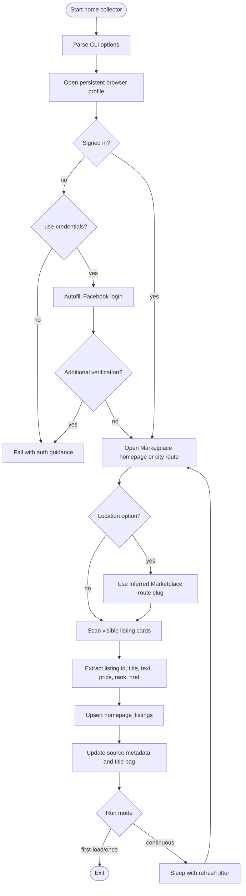
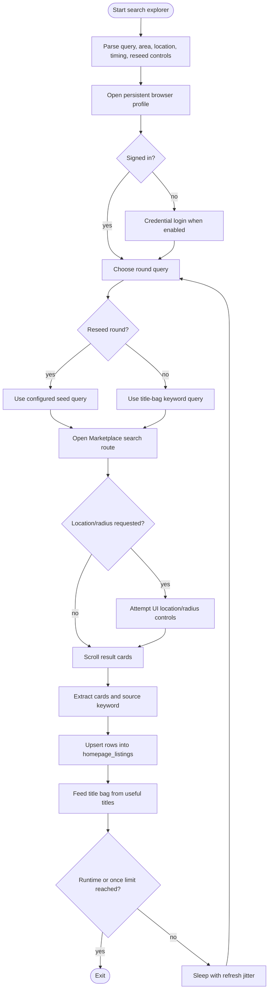
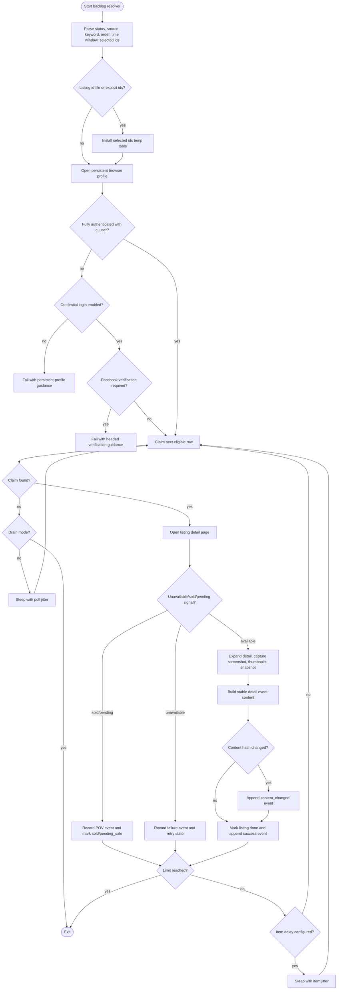
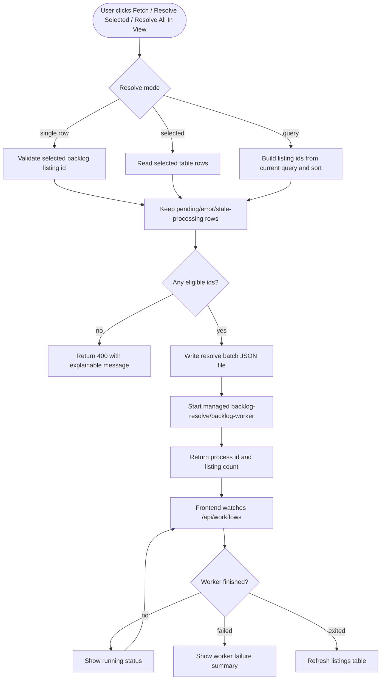
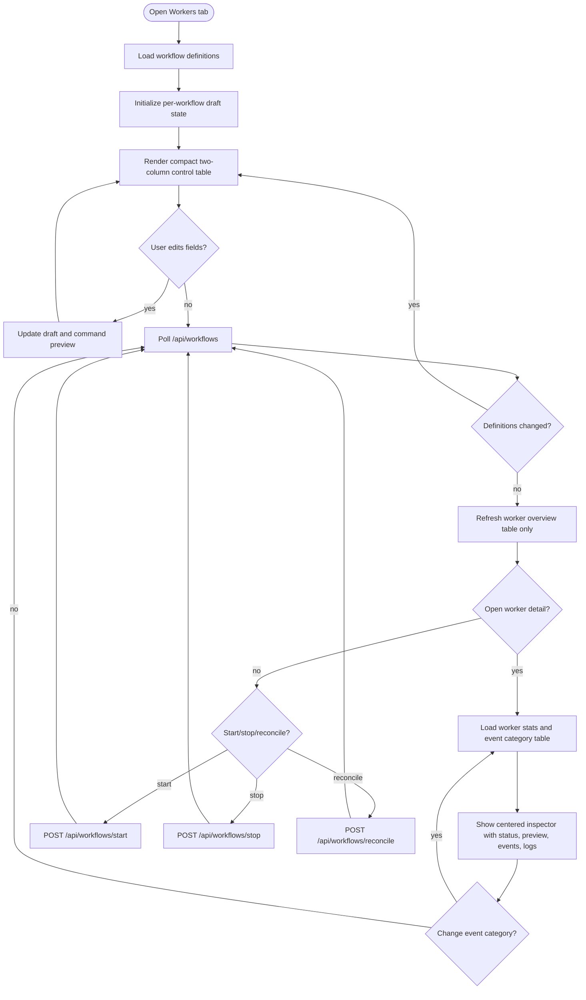

# Marketplace Workflow Flowcharts

These flowcharts describe the current local MVP workflows. They use Mermaid so GitHub can render them directly from Markdown.

## Homepage Collection

## Search Exploration

## Backlog Resolution

## Listings Viewer Resolve Dispatch

## Worker Management UI

